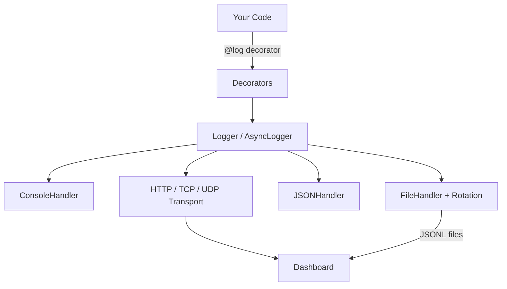
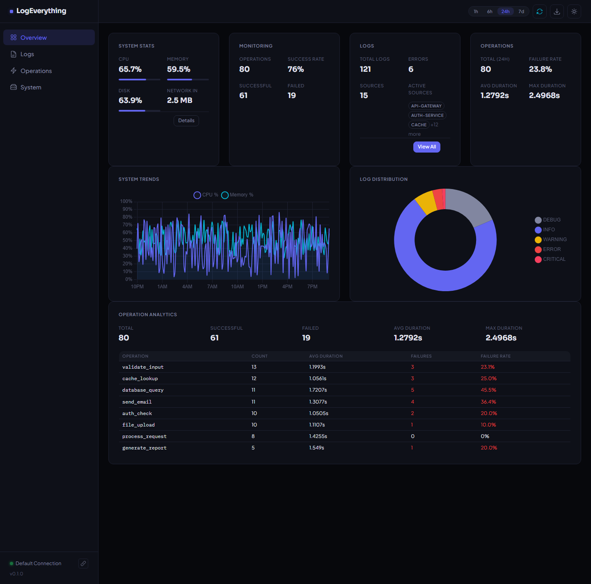

<p align="center">
  <h1 align="center">LogEverything</h1>
  <p align="center">
    <strong>High-performance Python logging with zero configuration.</strong>
  </p>
  <p align="center">
    <a href="https://pypi.org/project/logeverything/"></a>
    <a href="https://pypi.org/project/logeverything/"></a>
    <a href="https://github.com/RamishSiddiqui/logeverything/actions"></a>
    <a href="https://codecov.io/gh/RamishSiddiqui/logeverything"></a>
    <a href="https://opensource.org/licenses/MIT"></a>
    <a href="https://pypi.org/project/logeverything/"></a>
    <a href="https://github.com/RamishSiddiqui/logeverything"></a>
    <a href="https://github.com/RamishSiddiqui/logeverything/commits/main"></a>
    <a href="https://github.com/RamishSiddiqui/logeverything/issues"></a>
    <a href="https://github.com/RamishSiddiqui/logeverything/stargazers"></a>
  </p>
</p>

Add decorators to your functions for automatic, comprehensive logging. LogEverything captures inputs, outputs, execution times, and call hierarchy — with thread safety, async isolation, and beautiful formatting out of the box.

<table>
<tr>
<td align="center"><strong><h3>10k ops/sec</h3></strong><sub>Core Logging Throughput</sub></td>
<td align="center"><strong><h3>&lt;0.5ms</h3></strong><sub>Decorator Overhead</sub></td>
<td align="center"><strong><h3>7.9k ops/sec</h3></strong><sub>Print Capture</sub></td>
<td align="center"><strong><h3>395 tests</h3></strong><sub>65% coverage</sub></td>
</tr>
</table>

---

## Why LogEverything?

Most Python logging libraries make you choose: simple but limited (`logging`), fast but
opinionated (`loguru`), or structured but complex (`structlog`). LogEverything combines
decorator-based function tracing, native async support, structured JSON output, file
rotation, and a companion monitoring dashboard — all with zero-config defaults and
production-grade performance.

| Feature | `logging` | `loguru` | `structlog` | **LogEverything** |
|---|:---:|:---:|:---:|:---:|
| Zero-config decorators | | | | :white_check_mark: |
| Hierarchical call tracing | | | | :white_check_mark: |
| Async-native with task isolation | | | :white_check_mark: | :white_check_mark: |
| Structured JSON output | | :white_check_mark: | :white_check_mark: | :white_check_mark: |
| File rotation + gzip compression | :white_check_mark: | :white_check_mark: | | :white_check_mark: |
| Print capture (stdout redirect) | | | | :white_check_mark: |
| Monitoring dashboard | | | | :white_check_mark: |
| Configuration profiles | | | | :white_check_mark: |

---

## Install

```bash
pip install logeverything
```

## Quick Start

### Logger

```python
from logeverything import Logger

log = Logger("my_app")
log.info("Application started")
log.warning("Disk usage high")
log.error("Connection failed")
```

### Decorators

```python
from logeverything import Logger
from logeverything.decorators import log

app_log = Logger("my_app")

@log                          # auto-detect context
def process(items):
    return sum(items)

@log(using="my_app")          # target a specific logger
def validate(data):
    return len(data) > 0

process([1, 2, 3])
validate("hello")
```

**Output:**
```
-> process(items=[1, 2, 3]) [app.py:7]
<- process (0.03ms) -> 6
-> validate(data='hello') [app.py:11]
<- validate (0.01ms) -> True
```

### Hierarchical Call Tracing

```python
from logeverything.decorators import log_function

@log_function
def main():
    step1()

@log_function
def step1():
    step2()

@log_function
def step2():
    print("Processing...")

main()
```

```
-> main() [app.py:3]
|   -> step1() [app.py:7]
|   |   -> step2() [app.py:11]
|   |   |   Processing...
|   |   <- step2 (0.12ms)
|   <- step1 (0.45ms)
<- main (1.02ms)
```

### Async

```python
from logeverything import AsyncLogger
import asyncio

log = AsyncLogger("worker")

async def fetch(url):
    log.info(f"GET {url}")
    await asyncio.sleep(0.1)
    log.info("Done")

asyncio.run(fetch("https://api.example.com"))
```

### Profiles

```python
from logeverything import Logger

log = Logger("my_app")
log.configure(profile="production")    # minimal overhead, structured output
log.configure(profile="development")   # rich colors and visual hierarchy
log.configure(profile="api")           # optimized for web services
```

### CLI Tool

```bash
$ logeverything version
logeverything 0.1.0
Python 3.11.9
Platform: Windows-10-10.0.26100-SP0

$ logeverything doctor
logeverything doctor
  [✓] Python 3.11.9
  [✓] psutil 5.9.5
  [✗] celery (not installed)
  [✓] py.typed marker present
  [✗] Dashboard at localhost:8999 (not reachable)

$ logeverything init
Select environment type:
  1) web   2) script   3) notebook
→ Creates logging_config.py with sensible defaults
```

Also available as `python -m logeverything`.

### File Rotation

```python
from logeverything.handlers import TimedRotatingFileHandler

handler = TimedRotatingFileHandler(
    "logs/app.log",
    when="midnight",       # rotate daily at midnight
    retention_days=30,     # keep 30 days of logs
    compress=True,         # gzip old files
)
```

Size-based rotation with compression is also supported via `FileHandler`:

```python
from logeverything.handlers import FileHandler

handler = FileHandler(
    "logs/app.log",
    max_size=10_485_760,   # 10 MB
    backup_count=5,
    compress=True,         # gzip rotated files
)
```

For dashboard-compatible structured output, attach `JSONLineFormatter` to any handler:

```python
from logeverything.handlers import FileHandler, JSONLineFormatter

handler = FileHandler("logs/app.jsonl", max_size=10_485_760, backup_count=5)
handler.setFormatter(JSONLineFormatter(source="my_service"))
```

---

## Architecture



---

## Features

<table>
<tr>
<td width="50%" valign="top">

**Core**
- Unified `@log` decorator — functions, classes, async
- Smart logger selection with `using` parameter
- Auto-discovery and registration of logger instances
- Structured binding: `log.bind(user_id=123)`
- Context managers: `log.verbose()`, `log.quiet()`

</td>
<td width="50%" valign="top">

**Performance & Safety**
- 10k ops/sec core logging, 7.9k ops/sec print capture
- Async-native with 454 ops/sec task-isolated logging
- Zero overhead when logging is disabled
- Automatic thread-safe context isolation
- 395 tests, 65% coverage
- Cross-platform (Windows, macOS, Linux)

</td>
</tr>
<tr>
<td width="50%" valign="top">

**Output**
- Console, file, JSON, and JSONL (`JSONLineFormatter`) handlers
- Time-based and size-based file rotation with gzip
- Color themes with Unicode symbols
- Hierarchical indentation and aligned columns
- Automatic UTF-8 encoding on Windows
- 7.9k ops/sec `capture_print()` for stdout

</td>
<td width="50%" valign="top">

**Integrations**
- ASGI/WSGI middleware (FastAPI, Flask, Django)
- Celery task logging with correlation propagation
- Correlation IDs across requests and threads
- Log transports: HTTP, TCP, UDP
- CLI tool (`logeverything doctor`, `init`)
- Monitoring API with WebSocket streaming

</td>
</tr>
</table>

---

## Monitoring Dashboard

A companion web dashboard for exploring logs, operations, and system metrics in real time. The dashboard is **not included** in the base `pip install logeverything` — install it separately using one of the methods below.



### Install from PyPI

```bash
pip install logeverything-dashboard

# Start the dashboard
logeverything-dashboard                     # http://localhost:3001

# Point it at your log directory
logeverything-dashboard --data-dir ./logs

# Or connect to a remote LogEverything API
logeverything-dashboard --api-url http://localhost:8080/api/v1
```

### Install from Source

If you cloned the LogEverything repo, the dashboard is included in the `logeverything-dashboard/` directory:

```bash
cd logeverything-dashboard
pip install -r requirements.txt

# (Optional) Copy and edit the config file
cp config/settings.example.yaml config/settings.yaml

# Start the dashboard
python run_dashboard.py          # http://localhost:3001
```

<table>
<tr>
<td width="50%" valign="top">

**Pages**
- **Overview** — summary cards, CPU/memory trends, log distribution, operation analytics
- **Logs** — filterable table with multi-select level pills, pagination, flat + tree view
- **Operations** — analytics with failure rates and duration tracking
- **System** — detailed process/resource metrics, session info

</td>
<td width="50%" valign="top">

**Capabilities**
- Hierarchical tree view with expand/collapse and duration badges
- Time-range filtering (1h / 6h / 24h / 7d)
- Full-text log search and correlation ID tracing
- Dark and light themes
- Keyboard shortcuts, auto-refresh, JSON export
- Real-time updates via WebSocket

</td>
</tr>
</table>

[Dashboard Guide](docs/source/user-guide/dashboard.rst) — full documentation with screenshots, API endpoints, and customisation.

---

## Documentation

| | |
|---|---|
| [Installation](https://logeverything.readthedocs.io/en/latest/installation.html) | Setup and optional extras |
| [Quick Start](https://logeverything.readthedocs.io/en/latest/quickstart.html) | First steps with LogEverything |
| [User Guide](https://logeverything.readthedocs.io/en/latest/user-guide/logger-classes.html) | Logger classes, decorators, profiles, handlers, async, integrations |
| [Dashboard](https://logeverything.readthedocs.io/en/latest/user-guide/dashboard.html) | Monitoring dashboard setup and usage |
| [API Reference](https://logeverything.readthedocs.io/en/latest/api/core.html) | Complete module and class reference |
| [Advanced](https://logeverything.readthedocs.io/en/latest/advanced/performance.html) | Performance tuning and production deployment |

---

## Contributing

Contributions welcome. See the [Contributing Guide](https://logeverything.readthedocs.io/en/latest/contributing.html).

```bash
pip install -e ".[dev]"
logeverything doctor   # check environment and optional deps
make test              # run tests with coverage
make lint              # flake8, black, isort, mypy, bandit
make format            # auto-format
```

## License

MIT License. See [LICENSE](LICENSE) for details.

<p align="center"><sub>Built for developers who believe every function call tells a story.</sub></p>
